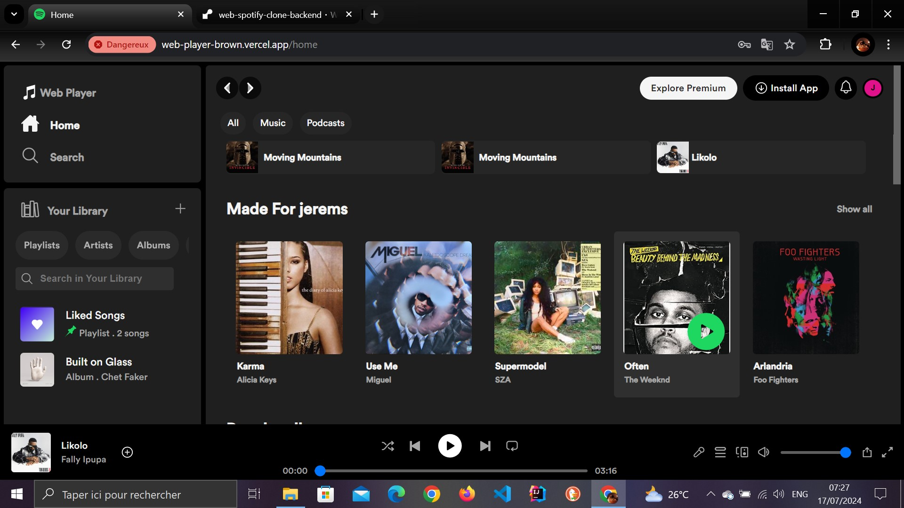
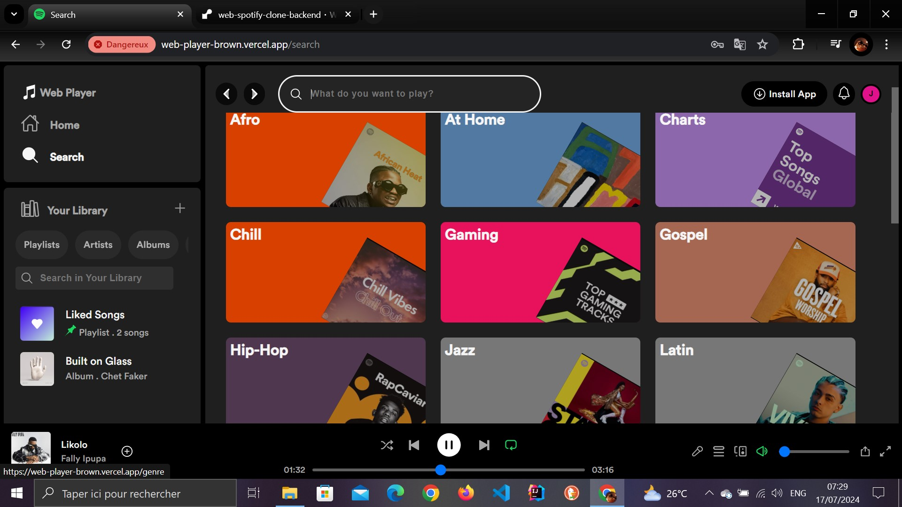
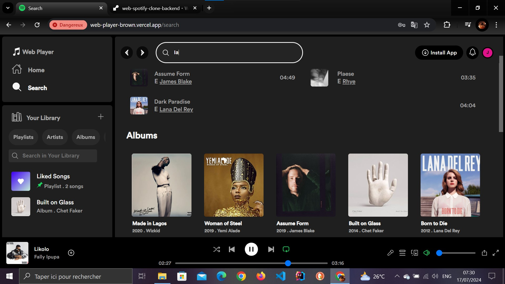

# Spotify web clone

This is a web spotify clone for improve my integration abilities.

## Table of contents

- [Overview](#overview)
  - [The challenge](#the-challenge)
  - [Screenshot](#screenshot)
  - [Links](#links)
- [My process](#my-process)
  - [Built with](#built-with)
  - [What I learned](#what-i-learned)
  - [Continued development](#continued-development)
  - [Useful resources](#useful-resources)
- [Author](#author)

## Overview

### The challenge

Users should be able to:

- Authenticate (Login and sign up)
- Play tracks
- add tracks to favorites
- See the favorites tracks
- See the tracks that are playing in the moment
- Next/preview/repeat track
- Search tracks by title or artist or album name
- See tracks by category
- See all categories
- Follow/unFollow artists
- See the artists that are following
- See all artists and search artist by name or by title track
- See favorites album
- Create playlist
- Add track for playlist created
- See the playlist created
- Search playlist created

### Screenshot








### Links

- Solution URL: [Add solution URL here](https://github.com/Jerems412Dev/web-spotify-clone)
- Live Site URL: [Add live site URL here](https://web-player-brown.vercel.app/)

## My process

### Built with

- Semantic HTML5 markup
- CSS custom properties
- Flexbox
- CSS Grid
- [Angular Js](https://angular.dev/) - Javascript framework

### What I learned

## 1- Data Binding:

Data binding lets you read and/or synchronize the properties and methods of your components directly in their templates.

- Interpolation

```html
<li>{{ listen }} monthly listeners</li>
```

```js
listen: number = Math.floor(Math.random() * (500000000 - 5000)) + 5000;
```

- Property binding

```html
<div [style.backgroundImage]="'url(assets/img/track/'+track?.profilePicture+'.jpg)'"></div>
```

- Event binding

```html
<a (mouseenter)="onMouseEnter()" (mouseleave)="onMouseLeave()" (click)="stopEventSvg()"></a>
```

```js
onMouseEnter() {
    if(this.playButton?.nativeElement) {
      this.playButton.nativeElement.style.opacity = "1";
      this.playButton.nativeElement.style.marginLeft = "56%";
    }
  }

  onMouseLeave() {
    if(this.playButton?.nativeElement) {
      this.playButton.nativeElement.style.opacity = "0";
      this.playButton.nativeElement.style.marginLeft = "0";
    }
  }

  onMouseEnterPause() {
    if(this.pauseButton?.nativeElement) {
      this.pauseButton.nativeElement.style.opacity = "1";
      this.pauseButton.nativeElement.style.marginLeft = "56%";
    }
  }
```

- Input and Output

```html
<!-- For @Input -->
<app-child [childData]="parentData"></app-child>
<!-- For @Output -->
<app-child (dataEmitter)="receiveData($event)"></app-child>
```

```js
import { Component, Input } from '@angular/core';

@Component({
  selector: 'app-child',
  template: '<p>{{ childData }}</p>',
})
export class ChildComponent {
  @Input() childData: string;
  @Output() dataEmitter = new EventEmitter<string>();
}
```

## 2- Directives *ngIf, *ngFor, *ngModel, *ngStyle, \*ngClass:

- we have also personalize directives

```js
import { Directive, ElementRef, AfterViewInit } from '@angular/core';

@Directive({
  selector: '[autoFocus]',
  standalone: true
})
export class AutoFocusDirective implements AfterViewInit {
  constructor(private elementRef: ElementRef) {}

  ngAfterViewInit() {
    this.elementRef.nativeElement.focus();
  }
}
```

## 3- Reactive Forms Module:

The principle behind responsive forms is to create an object that represents the form. This object is then linked to a <form> in the template.

```html
<form [formGroup]="loginForm" (ngSubmit)="onSubmit()">
  <div class="input_div">
    <label for="">E-mail or username</label>
    <div class="input">
      <input type="text" name="username" formControlName="username" placeholder="E-mail or username" required />
    </div>
  </div>
  <div class="input_div">
    <label for="">Password</label>
    <div class="input">
      <input type="password" name="password" formControlName="password" min="8" placeholder="Password" required #isToggle />
    </div>
  </div>
  <div class="remember_div">
    <input type="checkbox" name="" id="" />
    Remember me
  </div>
  <div class="input_submit">
    <input type="submit" value="Log In" />
  </div>
</form>
```

```js
export class UserFormComponent {
  loginForm: FormGroup;

  constructor(
    private route: Router,
    private formBuilder: FormBuilder,
    private authService: AuthenticationService,
    private tokenService: TokenService,
    private data: DataService
  ) {
    this.loginForm = this.formBuilder.group({
      username: ['', Validators.required],
      password: ['', Validators.required],
    });
  }

  onSubmit() {
    if (this.loginForm.valid) {
      // Envoi du formulaire
    }
  }
}
```

## 4- Guard CanActivate

A Guard allows you to authorize or deny navigation to a route. There are several types of Guard in Angular.

```js
import { CanActivateFn, Router } from "@angular/router";
import { inject } from "@angular/core";
import { TokenService } from "../services/Token.service";
import { map, tap } from "rxjs/operators";

export const authGuard: CanActivateFn = (route, state) => {
  const tokenService = inject(TokenService);
  const router = inject(Router);
  return tokenService.isAuthenticatedUser().pipe(
    tap((isAuthenticated) => {
      if (!isAuthenticated) {
        router.navigate(["/error"]);
      }
    }),
    map((isAuthenticated) => isAuthenticated)
  );
};
```

## 5- HTTP CLIENT

The HttpClient is Angular's utility for making Http GET, POST, DELETE, PUT and other requests.

```js
export const appConfig: ApplicationConfig = {
  providers: [provideHttpClient()],
};
```

```js
findRandom10Album(): Observable<Album[]> {
    return this.http.get<Album[]>(`${this.apiUrl}/albums/findrandom10album`, {
      headers: this.httpOptions.headers.set('Authorization', `Bearer ${this.tokenService.getToken()}`)
    });
  }
```

## 6- Pipe

A pipe in Angular is a simple way of transforming, formatting or filtering a value in your template.
This pipe, for example, was created to encrypt the name and id of albums, artists etc. in the url.

```js
@Pipe({
  name: 'encryption',
  standalone: true
})
export class EncryptionPipe implements PipeTransform {

  constructor(private encryptionService: EncryptionService) {}

  transform(value: string): string {
    return this.encryptionService.encrypt(value);
  }

}
```

## 7- Route

This is what links a url to a component.

```js
export const routes: Routes = [
  {
    path: "",
    title: "Login",
    component: LoginComponent,
  },
  {
    path: "register",
    title: "Register",
    component: RegisterComponent,
  },
];
```

## 8- Services

These are classes decorated by @Injectable(). They allow you to take advantage of Dependency Injection, which is central to Angular.

```js
@Injectable({
  providedIn: 'root'
})
export class AlbumService {
  private apiUrl: string = environment.apiUrl;
  private httpOptions = {
    headers: new HttpHeaders({ 'Content-Type': 'application/json' })
  };

  constructor(private http: HttpClient,private tokenService: TokenService) { }

  findRandom10Album(): Observable<Album[]> {
    return this.http.get<Album[]>(`${this.apiUrl}/albums/findrandom10album`, {
      headers: this.httpOptions.headers.set('Authorization', `Bearer ${this.tokenService.getToken()}`)
    });
  }
}
```

## 9- Component life cycle

In Angular, components have a life cycle. This means there's a point at which they're created, updated, destroyed and so on. All this is managed directly by the framework, and they provide us with methods to use directly in the components that correspond to their lifecycle moments. These methods are called lifecycle hooks.
The lifecycle hooks are the following:

- ngOnInit(): This hook is called after the component is initialized. It's a good place to initialize
- ngOnChanges(): This hook is called when the component's inputs change. It's a good place
- ngAfterViewInit: This method is called after the view of a component (and its children) has been fully initialized.
- ngOnDestroy: The ngOnDestroy method is called just before a component or directive is destroyed.

## 10- Standalone Components

They make @NgModule use optional, thanks to a standalone attribute that can be added to a component.

```js
@Component({
  selector: "app-album",
  standalone: true,
  template: `...`,
})
export class AlbumComponent {}
```

## 11- Architecture of files


### Continued development

For the future, I'd like to learn how to use resolvers and RxJs, which I didn't really use in this project.

### Useful resources

- [Angular Docs](https://angular.io/docs) - This helped me for understanding the basics of
- [Apprendre Bonjour Angular](https://apprendre.bonjour-angular.com/) - This helped me for everything i wanted to learn in angular

## Author

- LinkedIn - [Jérémy-Evrard OBIANG-ENGONE](https://www.linkedin.com/in/j%C3%A9r%C3%A9my-evrard-obiang-engone-257436247/)
- Twitter - [Check out Jerems✪🇬🇦 @jeremsOb ](https://x.com/jeremsOb?t=tuX8ctBHgo2b5buKLmVXXA&s=08)
